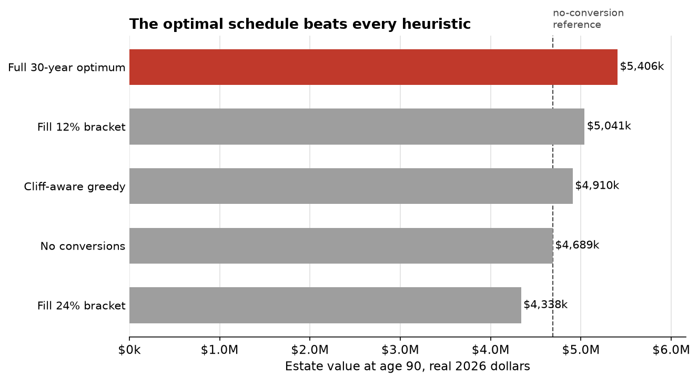
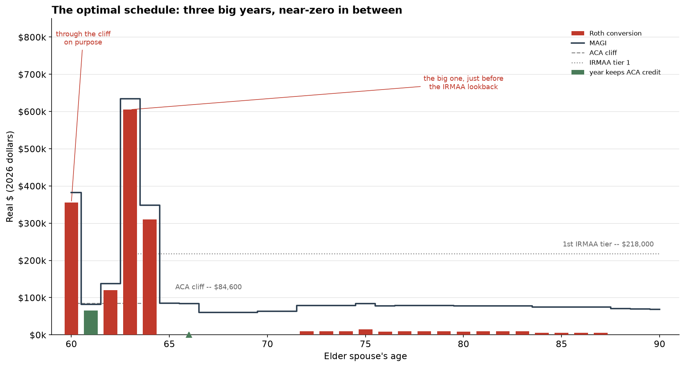

# The optimal Roth conversion schedule is lumpy, and every rule of thumb misses it

**TL;DR:** I modeled 30 years of Roth conversions for a retired 60/58 MFJ couple with $1.5M in a traditional IRA, against the actual 2026 rules: the ACA subsidy cliff at 400% FPL, IRMAA with its 2-year lookback, LTCG stacking, and NIIT. The popular "fill the 24% bracket" advice destroys about $351k of value versus doing nothing, because it burns the ACA subsidy five years running. The smarter heuristic most people here actually use, staying just under the cliff every year, still leaves about $496k on the table versus the true 30-year optimum. The optimal schedule is lumpy: three huge conversion years that blow straight through the cliff on purpose, and near-zero years in between. I also ran an open-source MILP optimizer (Owl) on the same inputs; it oscillates on this landscape and lands $390k short. Full notebook below, tax math cross-validated against PolicyEngine US.

## The scenario

A married couple, 60 and 58, retired at the start of 2026, filing MFJ in a no-income-tax state:

- Traditional IRA: $1,500,000
- Taxable brokerage: $600,000 (basis $540,000)
- Roth IRA: $200,000
- Spending: $70,000/yr in today's dollars
- Social Security: $30,000/yr each (today's dollars), both claiming at 70
- Pre-65 health insurance from the ACA marketplace: benchmark silver ~$22,600/yr for the couple (national average; more in WV or WY, less in a cheap state — the notebook takes it as a parameter)
- Returns: 4% real on everything, deterministic. No Monte Carlo, on purpose: the conversion decision is a tax problem, not a returns problem, and I didn't want "your return assumptions are doing the work" to be a possible objection. The cliff effects below survive at any reasonable fixed return.

Objective: after-tax value of the estate at the elder spouse's age 90, with the traditional IRA discounted at an heir's marginal rate of 24% and the taxable account getting a step-up in basis. (If you object to the heir-rate assumption, so did I; see the sensitivity section. It turns out not to matter.)

## The terrain, as of current law

Everything below is a statement of rules as legislated today (July 2026), not an opinion about whether they should exist. The notebook lets you swap any of them out.

1. **The ACA cliff is back.** The enhanced subsidies expired 2026-01-01. For a 2-person household, 400% of FPL is MAGI of $84,600 for 2026 coverage. One dollar over and the entire premium tax credit vanishes. For this couple that credit is worth roughly $14,000/yr at the margin — an effective infinite marginal rate at the boundary.
2. **IRMAA looks back two years.** Medicare premiums at 65 are set by your MAGI at 63. The 2026 tiers for MFJ start at $218k and each tier boundary is itself a small cliff ($1 over costs a couple roughly $2,300–$5,800/yr depending on the tier).
3. **LTCG stack on top of ordinary income.** A conversion dollar that pushes a qualified-dividend or LTCG dollar from the 0% to the 15% bracket has an effective marginal rate near 27%, inside the "safe" 12% bracket.
4. **NIIT** starts at $250k MAGI (MFJ, not indexed): conversions aren't investment income, but they push your dividends and gains over the threshold.

None of this is news to anyone who has spent time on the relevant forum threads. People here already know the cliff exists, already know about the lookback, and already hand-tune conversion plans around them. The question I wanted to answer is different: **if you jointly optimize all 30 years at once, what does the actual optimum look like, and how much do the heuristics leave behind?**

## Five policies, one model

| Policy | Estate at 90 (real $) | vs. no conversions |
|---|---|---|
| 1. No conversions | $4,689,000 | — |
| 2. Fill the 12% bracket every year | $5,041,000 | +$352k |
| 3. Fill the 24% bracket every year | $4,338,000 | **−$351k** |
| 4. Stay just under the ACA cliff, then fill brackets after 65 | $4,910,000 | +$221k |
| 5. Full 30-year joint optimization | $5,406,000 | **+$716k** |



Two things stand out.

**"Fill the 24% bracket" is worse than doing nothing.** This is the standard advice for a $1.5M IRA facing future RMDs, and several commercial planning tools will happily recommend it. For this couple it torches the ACA credit for five straight years, and the bracket arbitrage never earns it back. If you're on marketplace insurance, bracket-filling advice that ignores the cliff isn't suboptimal, it's negative-value.

**The cliff-aware heuristic leaves $496k versus the optimum.** Policy 4 is the smart play as usually practiced: compute the cliff, convert up to just under it, repeat annually. It beats bracket-filling by over half a million. And it still captures barely a third of what optimization finds.

## What the optimum actually looks like

Here is the optimal schedule (elder spouse's age; all real 2026 dollars):

| Year | Age | Conversion | MAGI | ACA credit kept | Notes |
|---|---|---|---|---|---|
| 2026 | 60 | $355,000 | $382k | $0 | through the cliff, on purpose |
| 2027 | 61 | $65,000 | $82k | $14,500 | just under the cliff |
| 2028 | 62 | $120,000 | $138k | $0 | sacrifices the credit for cheap 12% space |
| 2029 | 63 | $605,000 | $635k | $0 | the big one, before the IRMAA lookback window |
| 2030 | 64 | $310,000 | $348k | $0 | finishes the job |
| 2031–32 | 65–66 | $0 | ~$85k | partial | absorbs one low IRMAA tier for two years |
| 2038+ | 72+ | ~$10k/yr | ~$78k | — | mop-up under the SS tax hump |



The structure is what control theorists call bang-bang — full throttle or nothing, almost never in between. The intuition: the cliff is a fixed annual penalty, roughly $14k, regardless of whether you exceed it by one dollar or by half a million. A fixed toll is amortized by crossing big and crossing rarely. Spreading conversions evenly pays the toll every year; the optimum pays it three times in thirty years and shelters $1.5M.

The 2028 row is my favorite, because no rule of thumb produces it. The optimizer gives up that year's $14k credit to buy $120k of conversion space at a ~9% effective rate inside the 12% bracket. It's not "stay under the cliff" and it's not "go big" — it's a genuine interior trade-off that only shows up when the whole horizon is optimized jointly. I double-checked it by perturbing that year in every direction; it's a real feature of the solution, not solver noise.

Note also what the optimizer does at 63: the $605k conversion lands exactly in the last year before MAGI starts setting Medicare premiums via the 2-year lookback. The ACA problem and the IRMAA problem interlock, and the window between them (roughly ages 63–64 here, given when the IRA hits empty) is load-bearing.

## Does the heir-rate assumption drive this?

The most predictable objection: "your $496k depends on assuming heirs pay 24% on the inherited IRA." It doesn't. The optimal policy converts the entire IRA either way, so the terminal balance subject to the heir's rate is zero, and the gap versus the cliff-aware heuristic is identical at any heir rate from 12% to 32%:

| Heir's marginal rate | No conversions | Cliff-aware heuristic | Optimum | Gap |
|---|---|---|---|---|
| 0% | $5,144k | $4,910k | $5,407k | +$498k |
| 12% | $4,917k | $4,910k | $5,406k | +$497k |
| 24% | $4,689k | $4,910k | $5,406k | +$496k |
| 32% | $4,538k | $4,910k | $5,405k | +$495k |

At an heir rate of 0% (charity, or heirs in a zero bracket) the gap is larger, not smaller.

## I threw an actual optimizer at it, and it struggled

Fair question: fine, heuristics lose, but real optimization software exists. Owl (github.com/mdlacasse/Owl) is an actively maintained open-source planner that formulates this exact problem as a mixed-integer linear program, IRMAA and ACA included. I gave it the identical scenario.

Its solution converts $133k/yr for the first three years — through the cliff every time, forfeiting three years of credits without buying the big-conversion benefit — then spreads the rest thinly across two decades. Scored under one engine (mine, the PolicyEngine-validated one, so the comparison isn't apples-to-oranges), Owl's schedule finishes $390k behind the joint optimum. To be fair to Owl: its own engine also prices base Medicare premiums and optimizes withdrawal ordering, so transplanting its schedule into my engine costs it something. But the interesting part isn't the dollar figure, it's the solver log. Owl solves the nonlinearities (SS taxation, the credit formula) with a self-consistent loop around the LP, and on this landscape the loop doesn't converge: it oscillates between solutions $4.008M–$4.021M and exits on an iteration cap. From the solver log:

```
Iter: 08; f: $4,018,381; |df|: $6,759
Iter: 09; f: $4,011,284; |df|: $7,097
Iter: 10; f: $4,013,834; |df|: $2,550
Iter: 11; f: $4,021,176; |df|: $7,342
Iter: 12; f: $4,013,282; |df|: $7,893
Iter: 13; f: $4,021,731; |df|: $8,449
...
Iter: 28; f: $4,015,366; |df|: $4,237
Iter: 29; f: $4,020,925; |df|: $5,559
WARNING | Exiting loop on maximum iterations.
Convergence: oscillatory
```

That's not a bug in Owl; it's what happens when you point a convex-programming hammer at a genuinely non-convex objective. Cliffs make the problem the kind that needs dynamic programming or exhaustive search over the discrete structure, which is computationally fine here because the state space is small.

(The obvious missing comparison is ProjectionLab's v4.6 optimizer, which is the most capable commercial entry and explicitly models these cliffs. It sits behind a $129/yr subscription I haven't paid. If you have Premium, the notebook has everything needed to run the same scenario — I'd genuinely like to see the result.)

## Assumptions and receipts

- All 2026 constants (brackets, $32,200 MFJ standard deduction, LTCG thresholds, IRMAA tiers, FPL, applicable-percentage table) are tabulated in the notebook with IRS/CMS sources: Rev. Proc. 2025-32, Rev. Proc. 2025-25, CMS 2026 premium notice.
- Year-by-year federal tax is cross-validated against PolicyEngine US (8 representative cases, exact agreement to the dollar). An earlier $120 discrepancy turned out to be a real bug in my constants, not PolicyEngine's: I had the 12%→22% MFJ boundary at $99,600, but OBBBA gave the 10%/12% bracket ceilings an extra inflation bump, so the correct 2026 figure per Rev. Proc. 2025-32 is $100,800. Fixed; deviation is now zero.
- Deterministic 4% real return; 2.5% inflation deflates the non-indexed thresholds (SS provisional income, NIIT) in real terms.
- Simplifications you should know about: national-average SLCSP (~$22,600/yr). Premium is a parameter; the cliff only gets sharper in expensive states. Re-running in West Virginia, the priciest state (~$44,000/yr for this couple), the optimum-vs-heuristic gap *widens* from $496k to $513k — the bigger the subsidy at stake, the more the cliff-aware heuristic's every-year toll costs, and the more the lumpy optimum saves by paying it rarely. Qualified dividends at a 2% yield; 65+ additional standard deduction included; the OBBBA senior deduction expires (2028) before this couple reaches 65 and is a no-op here; single-owner IRA; no state tax. The optimizer is coordinate search with escape moves and a fine refinement pass — deterministic problem, so every claimed number is a reproducible lower bound on the true optimum, not a statistical estimate.

The point of publishing the notebook is that none of you should trust me. Substitute your own balances, your own state's SLCSP, your own heir assumptions, and check what the optimizer finds. If you find a bug, I want to know about it more than you do.

*I built this because I wanted the answer for a real situation and none of the tools I tried would compute it. I'm considering turning the multi-year optimizer into something interactive later; the notebook and everything in this post stay free and open regardless.*

## Repo contents

- `notebook.ipynb` — full model, executed, with all sources
- `scenario_a.py` — the scenario and optimizer
- `benchmark_owl.py` — reproduces the Owl (MILP) comparison (requires `owlplanner`)
- `validate_policyengine.py` — reproduces the PolicyEngine cross-validation (requires `policyengine-us`)
- `results_frozen.txt` — frozen numeric outputs referenced above
- `charts/` — the two charts embedded above
